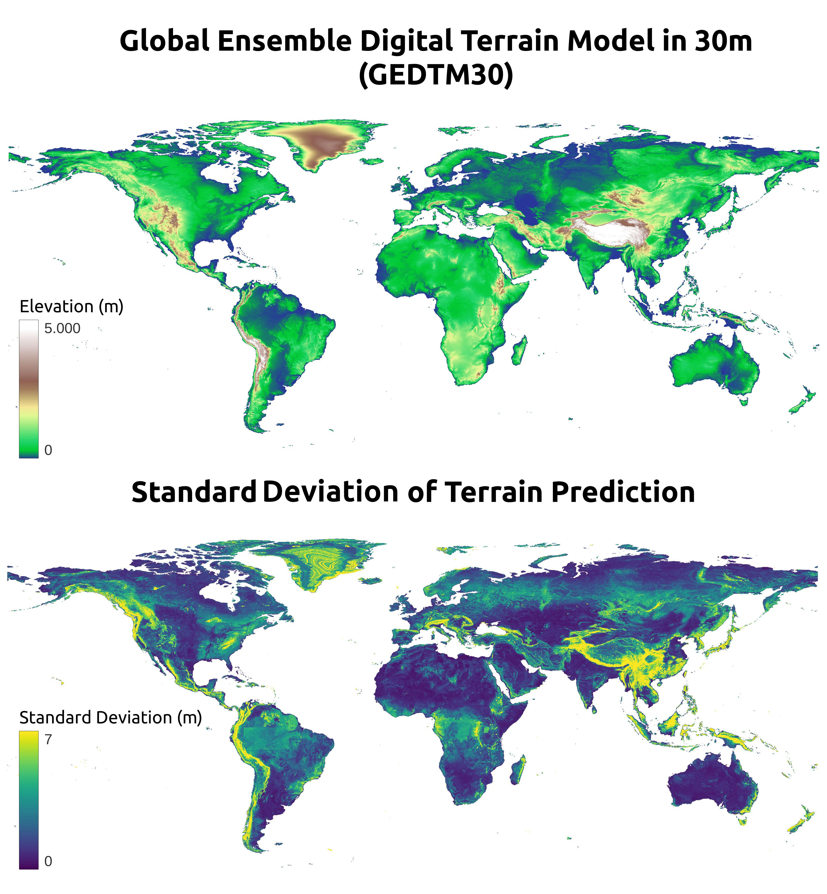

# GEDTM30

## Overview

GEDTM30 is a **global 1-arc-second (~30m) Digital Terrain Model (DTM)** built using a machine-learning-based data fusion approach. This dataset was generated using a global-to-local random forest model trained on ICEsat-2 and GEDI data, leveraging almost 30 billion of the highest-quality elevation points. 

GEDTM30 is also used to generate 15 land surface parameters at six scales (30, 60, 120, 240, 480 and 960m), covering aspects of topographic position, light and shadow, landform characteristics, and hydrology. A publication describing methods used has been submitted to PeerJ and is in review. The repository demonstrates the modeling and parametrization. 

## Data Components

1. **GEDTM30: Terrain Height Prediction**

Represents the predicted terrain height.

2. **Uncertainty Map of Terrain Prediction**

Provides an uncertainty map of the terrain prediction, derived from the standard deviation of individual tree predictions in the Random Forest model.



3. **15 land surface parameters**

Produced by DTM parametrization, representing different terrain features. Metadata of each parameter is currently stored at [scale.csv](parametrization/scaling.csv). The optimized [Equi7](https://github.com/TUW-GEO/Equi7Grid) tiling system for parameterization is currently stored at [equi7_tiles](parametrization/equi7_tiles).


- Landform:
[Slope in Degree](https://zenodo.org/records/14920379), [Geomorphons](https://zenodo.org/records/14920357)
- Light and Shadow:
[Positive Openness](https://zenodo.org/records/14920371), [Negative Openness](https://zenodo.org/records/14920369), [Hillshade](https://zenodo.org/records/14920359)
- Curvature:
[Minimal Curvature](https://zenodo.org/records/14920365), [Maximal Curvature](https://zenodo.org/records/14920363), [Profile Curvature](https://zenodo.org/records/14920373), [Tangential Curvature](https://zenodo.org/records/14920385), [Ring Curvature](https://zenodo.org/records/14920375), [Shape Index](https://zenodo.org/records/14920377)
- Local Topographic Position:
[Difference from Mean Elevation](https://zenodo.org/records/14919451), [Spherical Standard Deviation of the Normals](https://zenodo.org/records/14920383)
- Hydrology:
[Specific Catchment Area](https://zenodo.org/records/14920381), [LS Factor](https://zenodo.org/records/14920361), [Topographic Wetness Index](https://zenodo.org/records/14920387)

## Metadata and Scaling

<table border="1" style="border-collapse: collapse;">
  <tr>
    <th style="text-align: left; padding: 5px;">Layer</th>
    <th style="text-align: right; padding: 5px;">Scale</th>
    <th style="text-align: left; padding: 5px;">Data Type</th>
    <th style="text-align: right; padding: 5px;">No Data</th>
  </tr>
  <tr>
    <td style="text-align: left; padding: 5px;">Ensemble Digital Terrain Model</td>
    <td style="text-align: right; padding: 5px;">10</td>
    <td style="text-align: left; padding: 5px;">Int32</td>
    <td style="text-align: right; padding: 5px;">-2,147,483,647</td>
  </tr>
  <tr>
    <td style="text-align: left; padding: 5px;">Standard Deviation EDTM</td>
    <td style="text-align: right; padding: 5px;">100</td>
    <td style="text-align: left; padding: 5px;">UInt16</td>
    <td style="text-align: right; padding: 5px;">65,535</td>
  </tr>
  <tr>
    <td style="text-align: left; padding: 5px;">Difference from Mean Elevation</td>
    <td style="text-align: right; padding: 5px;">100</td>
    <td style="text-align: left; padding: 5px;">Int16</td>
    <td style="text-align: right; padding: 5px;">32,767</td>
  </tr>
  <tr>
    <td style="text-align: left; padding: 5px;">Geomorphons</td>
    <td style="text-align: right; padding: 5px;">1</td>
    <td style="text-align: left; padding: 5px;">Byte</td>
    <td style="text-align: right; padding: 5px;">255</td>
  </tr>
  <tr>
    <td style="text-align: left; padding: 5px;">Hillshade</td>
    <td style="text-align: right; padding: 5px;">1</td>
    <td style="text-align: left; padding: 5px;">UInt16</td>
    <td style="text-align: right; padding: 5px;">65,535</td>
  </tr>
  <tr>
    <td style="text-align: left; padding: 5px;">LS Factor</td>
    <td style="text-align: right; padding: 5px;">1,000</td>
    <td style="text-align: left; padding: 5px;">UInt16</td>
    <td style="text-align: right; padding: 5px;">65,535</td>
  </tr>
  <tr>
    <td style="text-align: left; padding: 5px;">Maximal Curvature</td>
    <td style="text-align: right; padding: 5px;">1,000</td>
    <td style="text-align: left; padding: 5px;">Int16</td>
    <td style="text-align: right; padding: 5px;">32,767</td>
  </tr>
  <tr>
    <td style="text-align: left; padding: 5px;">Minimal Curvature</td>
    <td style="text-align: right; padding: 5px;">1,000</td>
    <td style="text-align: left; padding: 5px;">Int16</td>
    <td style="text-align: right; padding: 5px;">32,767</td>
  </tr>
  <tr>
    <td style="text-align: left; padding: 5px;">Negative Openness</td>
    <td style="text-align: right; padding: 5px;">100</td>
    <td style="text-align: left; padding: 5px;">UInt16</td>
    <td style="text-align: right; padding: 5px;">65,535</td>
  </tr>
  <tr>
    <td style="text-align: left; padding: 5px;">Positive Openness</td>
    <td style="text-align: right; padding: 5px;">100</td>
    <td style="text-align: left; padding: 5px;">UInt16</td>
    <td style="text-align: right; padding: 5px;">65,535</td>
  </tr>
  <tr>
    <td style="text-align: left; padding: 5px;">Profile Curvature</td>
    <td style="text-align: right; padding: 5px;">1,000</td>
    <td style="text-align: left; padding: 5px;">Int16</td>
    <td style="text-align: right; padding: 5px;">32,767</td>
  </tr>
  <tr>
    <td style="text-align: left; padding: 5px;">Ring Curvature</td>
    <td style="text-align: right; padding: 5px;">10,000</td>
    <td style="text-align: left; padding: 5px;">Int16</td>
    <td style="text-align: right; padding: 5px;">32,767</td>
  </tr>
  <tr>
    <td style="text-align: left; padding: 5px;">Shape Index</td>
    <td style="text-align: right; padding: 5px;">1,000</td>
    <td style="text-align: left; padding: 5px;">Int16</td>
    <td style="text-align: right; padding: 5px;">32,767</td>
  </tr>
  <tr>
    <td style="text-align: left; padding: 5px;">Slope in Degree</td>
    <td style="text-align: right; padding: 5px;">100</td>
    <td style="text-align: left; padding: 5px;">UInt16</td>
    <td style="text-align: right; padding: 5px;">65,535</td>
  </tr>
  <tr>
    <td style="text-align: left; padding: 5px;">Specific Catchment Area</td>
    <td style="text-align: right; padding: 5px;">1,000</td>
    <td style="text-align: left; padding: 5px;">UInt16</td>
    <td style="text-align: right; padding: 5px;">65,535</td>
  </tr>
  <tr>
    <td style="text-align: left; padding: 5px;">Spherical Standard Deviation of the Normals</td>
    <td style="text-align: right; padding: 5px;">100</td>
    <td style="text-align: left; padding: 5px;">Int16</td>
    <td style="text-align: right; padding: 5px;">32,767</td>
  </tr>
  <tr>
    <td style="text-align: left; padding: 5px;">Tangential Curvature</td>
    <td style="text-align: right; padding: 5px;">1,000</td>
    <td style="text-align: left; padding: 5px;">Int16</td>
    <td style="text-align: right; padding: 5px;">32,767</td>
  </tr>
  <tr>
    <td style="text-align: left; padding: 5px;">Topographic Wetness Index</td>
    <td style="text-align: right; padding: 5px;">100</td>
    <td style="text-align: left; padding: 5px;">Int16</td>
    <td style="text-align: right; padding: 5px;">32,767</td>
  </tr>

   
 
</table>

## Usage

This dataset is designed for researchers, developers, and professionals working in earth sciences, GIS, and remote sensing. It can be integrated into various geospatial analysis workflows to enhance terrain representation and modeling accuracy. This dataset covers the entire world and is well-suited for applications in:

- Topography

- Hydrology

- Geomorphometry

- Others

## Getting Started

- Access and test the model and parametrization, please clone this repository:

```
git clone https://github.com/openlandmap/GEDTM30.git
```

- Download the data set from Zenodo ([10.5281/zenodo.14900181](https://zenodo.org/records/14900181))


## Citation

If you use this dataset in your research or application, please cite:
```
Ho, Y., & Hengl, T. (2025). Global Ensemble Digital Terrain Model 30m (GEDTM30) (Version v20250130) [Data set]. Zenodo. https://doi.org/10.5281/zenodo.14900181
```
## License

This dataset is released under fully open license [CC-BY 4.0](https://creativecommons.org/licenses/by/4.0/deed.en). 

## Contact

For any questions or contributions, feel free to open an issue or reach out via [yu-feng.ho@opengeohub.org].